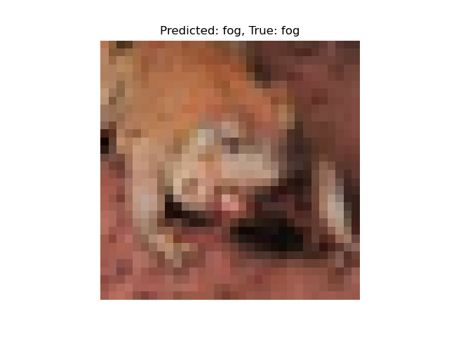

# image-classifier

Image-classifier is an image classification project built using TensorFlow and Keras. It implements a complete pipeline for classifying images from the CIFAR-10 dataset, which contains 60,000 small 32×32 color images across 10 categories such as airplanes, cars, and animals. 

Example output:

**Prediction:** `frog`  
**True Label:** `frog`

## Summary

The project begins by loading and normalizing the dataset, followed by building a custom convolutional neural network (CNN) from scratch using multiple convolutional and pooling layers, topped with dense layers for final classification. The model is trained on the dataset and saved to disk, allowing it to be reloaded for future use without retraining. Once trained, the model predicts labels for unseen test images and displays the results with both predicted and true labels shown side by side. Model performance is evaluated using accuracy, a classification report with precision, recall, and F1-score, and a confusion matrix to visualize class-wise performance.

## Dataset

The project uses the CIFAR-10 dataset, which contains 60,000 32x32 color images in 10 different classes:
- airplane
- automobile
- bird
- cat
- deer
- dog
- frog
- horse
- ship
- truck

## Technologies Used

- Python 3.9+
- TensorFlow
- Keras
- NumPy
- Matplotlib
- scikit-learn

### Example Classification Report

| Class       | Precision | Recall | F1-score | Support |
|-------------|-----------|--------|----------|---------|
| airplane    | 0.69      | 0.66   | 0.67     | 1000    |
| automobile  | 0.78      | 0.76   | 0.77     | 1000    |
| bird        | 0.56      | 0.53   | 0.54     | 1000    |
| cat         | 0.47      | 0.42   | 0.44     | 1000    |
| deer        | 0.62      | 0.57   | 0.59     | 1000    |
| dog         | 0.49      | 0.63   | 0.55     | 1000    |
| frog        | 0.76      | 0.73   | 0.75     | 1000    |
| horse       | 0.72      | 0.71   | 0.71     | 1000    |
| ship        | 0.72      | 0.80   | 0.76     | 1000    |
| truck       | 0.75      | 0.71   | 0.73     | 1000    |
| **Accuracy**|           |        | **0.65** | 10000   |
| Macro avg   | 0.65      | 0.65   | 0.65     | 10000   |
| Weighted avg| 0.65      | 0.65   | 0.65     | 10000   |

### Example Confusion Matrix

| True\Pred | Airplane | Auto | Bird | Cat | Deer | Dog | Frog | Horse | Ship | Truck |
|-----------|----------|------|------|-----|------|-----|------|--------|------|--------|
| Airplane  | 660      | 24   | 64   | 27  | 30   | 14  | 9    | 14     | 116  | 42     |
| Auto      | 37       | 758  | 15   | 11  | 5    | 4   | 6    | 6      | 57   | 101    |
| Bird      | 68       | 12   | 528  | 78  | 79   | 114 | 50   | 33     | 23   | 15     |
| Cat       | 20       | 15   | 67   | 424 | 74   | 252 | 59   | 44     | 25   | 20     |
| Deer      | 16       | 6    | 88   | 63  | 569  | 94  | 51   | 90     | 18   | 5      |
| Dog       | 10       | 5    | 66   | 158 | 35   | 632 | 26   | 55     | 9    | 4      |
| Frog      | 9        | 5    | 49   | 71  | 47   | 55  | 730  | 14     | 9    | 11     |
| Horse     | 21       | 5    | 36   | 38  | 69   | 99  | 10   | 706    | 5    | 11     |
| Ship      | 73       | 36   | 13   | 17  | 6    | 12  | 7    | 5      | 803  | 28     |
| Truck     | 43       | 109  | 13   | 21  | 6    | 13  | 8    | 20     | 57   | 710    |
